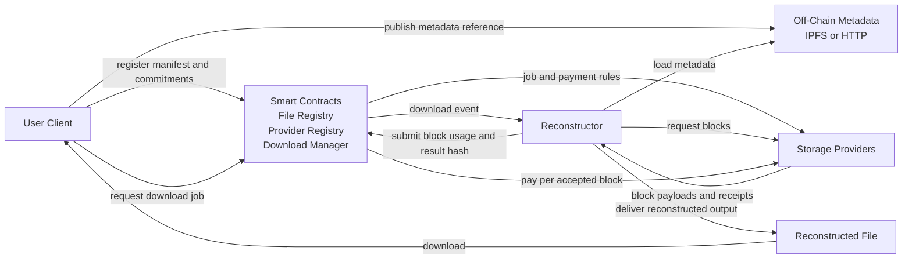

# HySail DApp Architecture

## Overview

This document describes a simplified DApp architecture for HySail.

The target model is:

1. The user encodes a file and registers its metadata commitments on-chain.
2. The user opens a download request through the chain.
3. Providers deliver blocks off-chain.
4. A reconstructor validates the blocks and rebuilds the file off-chain.
5. The smart contract verifies commitments, tracks accepted blocks, and pays providers.

The key design rule is simple: the chain coordinates and settles; it does not fetch remote blocks or reconstruct large files.

## Architecture

## Responsibilities

### User Client

1. Generates the encoded artifacts.
2. Registers the file manifest on-chain.
3. Opens the download request.
4. Retrieves the reconstructed file.

### Storage Providers

1. Store encoded blocks.
2. Serve blocks for active jobs.
3. Receive payment for accepted block usage.

### Smart Contracts

1. Register files and providers.
2. Create download jobs.
3. Verify block commitments and job rules.
4. Prevent duplicate payments.
5. Release payment to providers.

### Reconstructor

1. Reads the job request.
2. Fetches metadata and blocks.
3. Validates each block against the registered commitments.
4. Executes the decode flow off-chain.
5. Publishes the final result hash or attestation.

## On-Chain and Off-Chain Split

### On-Chain

The chain is responsible for:

1. File registration.
2. Provider registration.
3. Download job creation.
4. Commitment verification.
5. Escrow and settlement.

### Off-Chain

The off-chain layer is responsible for:

1. Metadata storage.
2. Block transport.
3. Block validation using fetched bytes.
4. File reconstruction.
5. Final file delivery.

## Why Reconstruction Stays Off-Chain

The file should not be reconstructed inside the smart contract because:

1. Contracts do not fetch arbitrary remote data.
2. File-sized byte processing is too expensive on-chain.
3. Contracts expose state and events, not downloadable files.

This means the smart contract validates commitments and payment conditions, while the actual decode runs outside the chain.

## Core Contract Model

### File Registry

Stores:

1. File identifier.
2. Owner.
3. Metadata hash.
4. Block root.
5. Final file hash.
6. Metadata location.

### Provider Registry

Stores:

1. Provider identity.
2. Payout address.
3. Endpoint reference.
4. Pricing policy.

### Download Manager

Stores:

1. Download job state.
2. Requester budget.
3. Accepted blocks.
4. Paid claims.
5. Reconstruction result hash.

## Validation and Payment

The contract can validate:

1. The job is active.
2. The provider is authorized.
3. The block belongs to the file.
4. The block matches the registered commitment.
5. The block has not been paid already.
6. The final result hash matches the registered file hash.

The payment model is per accepted block:

1. The requester funds the job.
2. The reconstructor submits accepted block usage.
3. The contract marks the block as claimed.
4. The provider receives payment.
5. Remaining funds are refunded when the job ends.

## Recommended Data Shapes

The DApp should avoid Python-specific serialization.

### File Manifest

1. fileId
2. owner
3. originalFilename
4. originalFileHash
5. manifestHash
6. blockRoot
7. metadataUri

### Block Descriptor

1. blockId
2. providerAddress
3. packetIndex
4. degree
5. indices
6. blockHash
7. pricePerUse
8. transportUri

### Download Job

1. jobId
2. fileId
3. requester
4. budget
5. status
6. usedBlockSet
7. reconstructionResultHash

## Trust Model

There are three reasonable options for proving correct usage of blocks:

1. Client receipt.
2. Reconstructor attestation.
3. Zero-knowledge proof.

The most practical starting point is reconstructor attestation, because it keeps the system simple without pushing the decode algorithm on-chain.

## Fit with the Current Repository

The current HySail code is not DApp-ready in three areas:

1. Metadata uses pickle serialization.
2. Providers are modeled as local filesystem storage.
3. Decode assumes direct local or synchronous provider access.

A DApp-oriented version should move toward:

1. Portable metadata such as JSON or CBOR.
2. Provider access through HTTP, IPFS, or another transport-neutral interface.
3. Commitment-based validation instead of implicit local trust.

## Final View

The correct DApp architecture for HySail is not a contract that downloads, reconstructs, and returns files.

The correct architecture is:

1. Providers store and serve blocks.
2. The chain registers commitments and pays providers.
3. A reconstructor rebuilds the file off-chain.
4. The user receives the final file after the result is validated.

This preserves the HySail model while making the system compatible with blockchain constraints.
