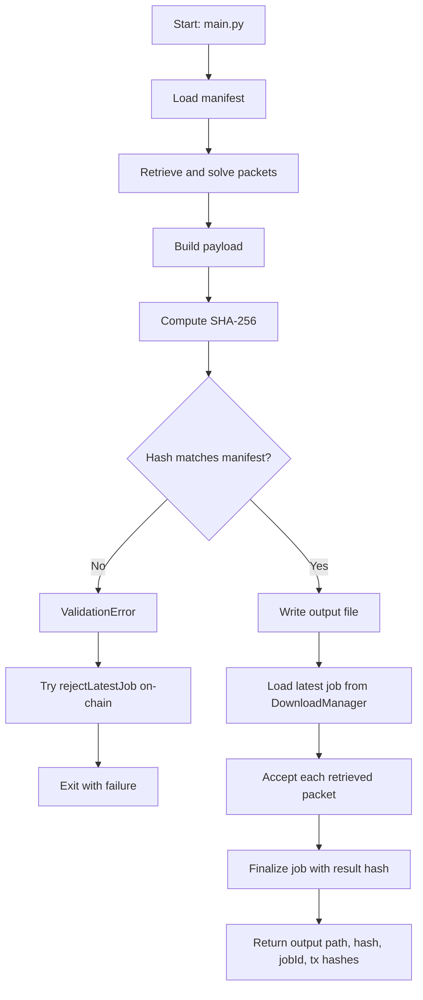

# Reconstructor Service

The reconstructor is the off-chain worker that rebuilds a requested file from packet data and then settles the corresponding on-chain download job.

## What it does

1. Loads the manifest (packets, expected hash, provider endpoint, and metadata).
2. Iteratively solves packet equations until all original block indices are reconstructed.
3. Builds the final payload and verifies its SHA-256 hash against `originalFileHash`.
4. Writes the reconstructed output file.
5. Accepts solved packets and finalizes the download job on-chain.
6. If validation fails, attempts to reject the latest job to refund the requester.

## Runtime behavior



## Important details

- Packets are grouped by degree and repeatedly reduced with known blocks until all block indices are solved.
- For remote packets, the provider is challenged before download (`/challenge`) and only then the block bytes are fetched (`/blocks/{blockId}`).
- Settlement uses the configured requester private key and the deployed `DownloadManager` address.

## Configuration

Default values are read from constants and environment variables:

- `Hysail_RPC_URL`: RPC endpoint (default `http://127.0.0.1:8545`).
- `Hysail_PRIVATE_KEY`: requester key used to sign settlement transactions.
- `Hysail_JOB_ID`: optional explicit job id; otherwise the latest job is used.

## Entry point

Run:

```bash
python dapp/services/reconstructor/main.py
```

On success, logs include output path, reconstructed hash, finalized job id, and transaction hashes.
